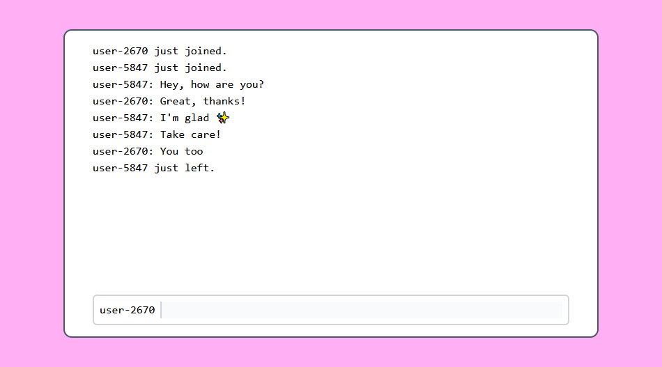

# glot

A simple chatroom using [mist](https://github.com/rawhat/mist)

### Requirements

  - `gleam` (>= v0.22)
  - `nodejs`

### Running

There is a `run.sh` script. It does require [watchexec](https://github.com/watchexec/watchexec).

It just runs both `gleam run` and `npm run watch` in the `assets/` directory.

Then, navigate to `http://localhost:8080` with any number of clients.
